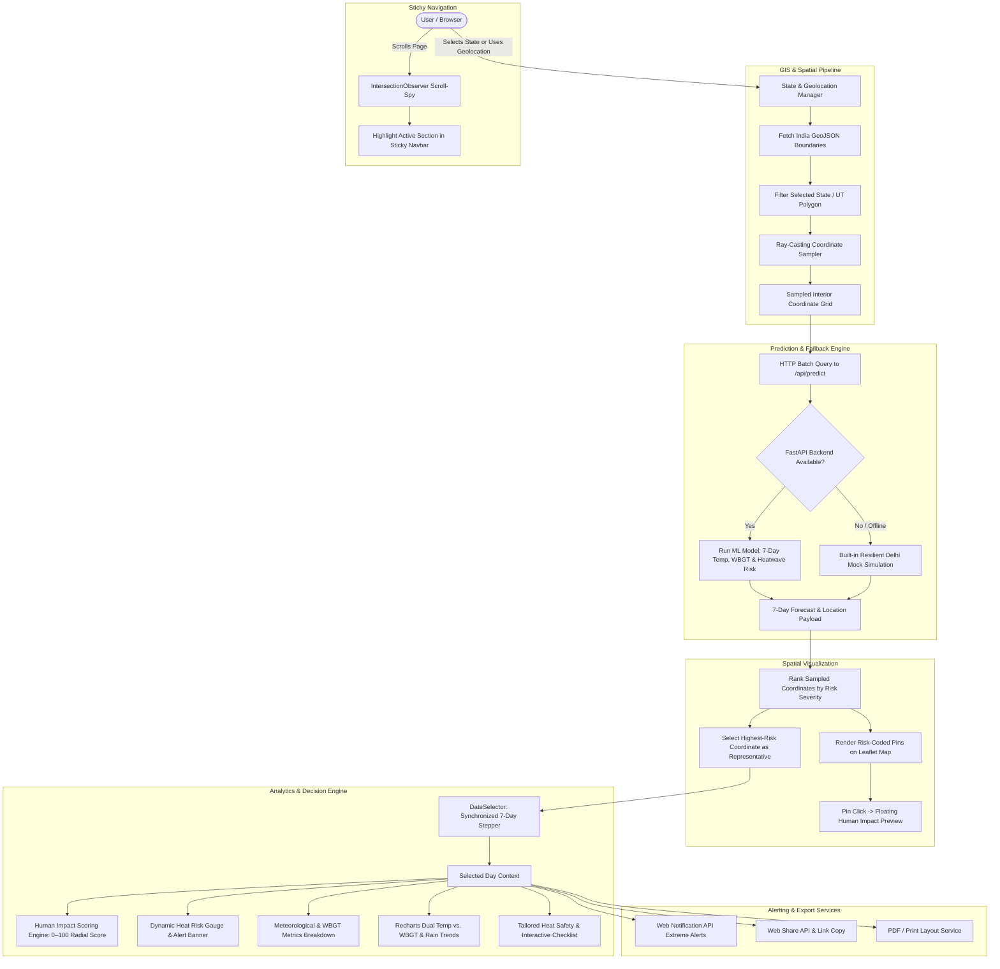

# HeatGuard - Project Workflow & Architecture Documentation

**HeatGuard** is an AI-powered Heat-Stress Intelligence & Public Risk Assessment platform for India. It transforms raw meteorological parameters and machine learning predictions into actionable Wet Bulb Globe Temperature (WBGT) heat-stress analytics, localized spatial risk mapping, demographic human vulnerability assessments, and tailored safety advisories.

---

## 1. System Architecture & End-to-End Workflow



---

## 2. Comprehensive Workflow Steps

### Step 1: State Selection & Geolocation Detection
- **Manual State Selection**: Users select any Indian State or Union Territory via the searchable dropdown or quick-select pills (Delhi, Maharashtra, Rajasthan, Uttar Pradesh, Tamil Nadu).
- **"Use My Location" Geolocation**: Utilizing the HTML5 `navigator.geolocation` API, the browser acquires the user's high-accuracy latitude and longitude.
- **Reverse Spatial Geocoding**: The application performs point-in-polygon verification against the loaded India GeoJSON features to identify which state contains the user's coordinates.

### Step 2: GeoJSON Boundary Loading & Ray-Casting Sampling
- **Dynamic GeoJSON Fetch**: Fetches official boundary geometries (`udit-001/india-maps-data`).
- **Smooth Auto-Zoom**: Leaflet automatically animates and zooms (`fitBounds`) to the exact bounding box of the selected state.
- **Ray-Casting Algorithm**: The client samples candidate grid points across the bounding box and executes ray-intersection checks against multi-polygon boundaries, keeping only coordinates that fall strictly within the land borders of the state.

### Step 3: ML Prediction Service & Offline Resilience
- **API Request**: Sampled coordinates are transmitted to the backend prediction service (`GET /api/predict?latitude=...&longitude=...`).
- **Coverage Validation**:
  - **Delhi (Active ML)**: Predictions are actively served by trained ML models calculating dry-bulb temperatures, Wet Bulb Globe Temperature (WBGT), heatwave occurrence, and timing windows.
  - **Other States**: Cleanly flagged with a *"Coverage in Progress"* notice while retaining full interactive GIS boundary visualization.
- **Built-in Offline Resilience**: If the Python FastAPI backend is offline or unreachable, the frontend automatically falls back to an internal simulation model (`generateDelhiMockForecast`). This ensures seamless user evaluation, live demos, and uninterrupted testing without hard crashes.

### Step 4: Spatial Risk Distribution & Representative Forecast
- **Risk Classification**: Coordinates are ranked based on risk severity:
  $$\text{Risk Levels} \in \{\text{Low (Green)}, \text{Moderate (Yellow)}, \text{High (Orange)}, \text{Very High (Red)}, \text{Extreme (Dark Red)}\}$$
- **Representative Point**: The coordinate exhibiting the highest heat-stress risk is automatically assigned as the representative baseline to drive all dashboard analytics.
- **Interactive Pin Click**: Clicking any coordinate marker on the Leaflet map opens a floating Human Impact Preview card with a direct smooth-scroll link to the Human Impact section.

### Step 5: 7-Day Synchronized Date Stepper & Carousel
- **Synchronized Active Day**: The `DateSelector` component allows users to switch between the 7 forecast days using:
  - Previous / Next buttons.
  - "Back to Today" quick jump.
  - Horizontal 7-day mini-cards showing day name, date, max temperature, and risk status dot.
- **Unidirectional State Flow**: Changing the active date instantly updates the Human Impact radial score, Risk Overview meter, WBGT gauge, Meteorological metrics, and Safety checklist.

### Step 6: Human Impact Scoring Engine
The platform combines physical heat metrics with demographic factors to compute an actionable Human Impact Index (0 to 100):

$$\text{Human Impact Score} = \text{Thermal Stress (50\%)} + \text{Vulnerability (30\%)} + \text{Exposure (20\%)}$$

- **Thermal Stress (50%)**: Derived from normalized WBGT maximum ($20^\circ\text{C}$ to $36^\circ\text{C}$) and heatwave occurrence.
- **Demographic Vulnerability (30%)**: Combines elderly population ratio and urban density factors.
- **Outdoor Worker Exposure (20%)**: Factors in agricultural, construction, and gig-economy labor exposure.
- **Action Intelligence Chips ("Recommended Now")**: Interactive trigger pills (*Hydration*, *Shift Work Hours*, *Elderly Alert*, *Hospital Readiness*, *Cooling Shelters*) with hover tooltips detailing response protocols.

### Step 7: Environmental Metrics & Visual Charts (Recharts)
- **Air Temperature vs. WBGT Dual Trends**: Compares ambient temperature against WBGT indices over the 7-day forecast window.
- **Critical Threshold Line**: Highlights the $30^\circ\text{C}$ WBGT heatwave cutoff.
- **Precipitation Bar Chart**: Displays daily rainfall depth with conditional bar highlights.
- **WBGT Education Section**: Visual gauge displaying current WBGT relative to safe and extreme thresholds, accompanied by explanatory scientific notes.

### Step 8: Safety Guidelines, Alerts & Export
- **Risk-Adaptive Advice**: Dynamically provides tailored guidelines for Hydration, Sun Protection, Cooling Breaks, and Vulnerable Care.
- **Interactive Checklist**: Users can tick off completed safety precautions with an active completion counter (`X / Y Completed`).
- **Browser Notifications**: Requests permission and triggers system notifications if an Extreme heat-stress day is detected.
- **Sharing & PDF Export**: Native Web Share API integration with clipboard fallback and a print-optimized PDF layout.

---

## 3. Component Architecture & Hierarchy

```
src/
├── main.jsx                       # Application root & StrictMode wrapper
├── styles.css                     # OKLCH design tokens, gradients, animations
├── routes/
│   └── index.jsx                  # Main page orchestrator (state, layout, loading & error guards)
├── components/
│   ├── heatguard/
│   │   ├── Navbar.jsx             # Sticky header with scroll-spy & backend health status
│   │   ├── Hero.jsx               # Hero section, value propositions & map integration
│   │   ├── StateRiskMap.jsx       # Leaflet map, GeoJSON loader, ray-casting & pin popups
│   │   ├── LocationCard.jsx       # State header, PDF export, alert toggle & share actions
│   │   ├── HeatwaveAlert.jsx      # High-priority alert banner for multi-day heatwaves
│   │   ├── DateSelector.jsx       # 7-day timeline controller with relative labels & day navigation
│   │   ├── HumanImpact.jsx        # SVG radial score ring, demographic bars & action chips
│   │   ├── RiskOverview.jsx       # Risk level badge, dynamic gauge & condition breakdown
│   │   ├── MetricsGrid.jsx        # 6-card environmental metrics grid (Temp, WBGT, Rain, etc.)
│   │   ├── ForecastList.jsx       # Comprehensive 7-day card carousel with selection sync
│   │   ├── Charts.jsx             # Recharts interactive dual-trend & precipitation charts
│   │   ├── SafetySection.jsx      # Dynamic guidance with interactive completion checklist
│   │   ├── WbgtSection.jsx        # WBGT index educational gauge & scientific threshold
│   │   ├── LoadingState.jsx       # Loading skeletons and state indicators
│   │   ├── ErrorState.jsx         # User-friendly error card with retry mechanism
│   │   └── Footer.jsx             # Platform footer with metadata & acknowledgments
│   └── ui/                        # Reusable Radix UI & design system primitives
└── lib/
    ├── api.js                     # API client, health check, validation & mock simulation fallback
    ├── risk.js                    # Risk levels, color tokens, date formatting & WBGT constants
    ├── vulnerabilityData.js       # Demographic profiles, scoring formula & action configurations
    └── utils.js                   # Class utility helpers (clsx + twMerge)
```

---

## 4. Key Data Models & Contracts

### 7-Day Forecast Day Object (`api.js`)
```typescript
interface ForecastDay {
  date: string;                     // "YYYY-MM-DD"
  heatwave: boolean;                // true if WBGT >= 30.0°C cutoff
  risk: "Low" | "Moderate" | "High" | "Very High" | "Extreme";
  heatwave_timing?: {
    label: string;                  // e.g. "11:30 AM - 05:00 PM (Severe Heatwave Window)"
  };
  temperature: {
    max: number;                    // e.g. 44.5 (°C)
    mean: number;                   // e.g. 37.2 (°C)
  };
  wbgt: {
    max: number;                    // e.g. 34.2 (°C)
    mean: number;                   // e.g. 30.1 (°C)
  };
  rain: {
    total: number;                  // e.g. 0.0 (mm)
    status: string;                 // e.g. "No rain"
  };
}
```

### Human Impact Evaluation Object (`vulnerabilityData.js`)
```typescript
interface HumanImpactResult {
  score: number;                    // 0 to 100
  category: "LOW" | "MODERATE" | "HIGH" | "VERY HIGH" | "EXTREME";
  color: string;                    // CSS variable string
  textColor: string;                // Tailwind text utility
  bgSoft: string;                   // Tailwind background utility
  borderColor: string;              // Tailwind border utility
  peakRisk: string;                 // Peak exposure hours string
  maxWbgt: number;
  vulnerabilities: {
    elderly: { level: string; score: number; text: string };
    outdoorWorkers: { level: string; score: number; text: string };
    density: { level: string; score: number; text: string };
  };
}
```

---

## 5. Technology Stack Summary

| Layer | Technologies |
|---|---|
| **Core Framework** | React 19, JavaScript (JSX), Vite 8 |
| **Styling & Tokens** | Tailwind CSS v4 (`@tailwindcss/vite`), Vanilla CSS OKLCH design variables |
| **GIS & Mapping** | Leaflet 1.9.4, React-Leaflet 5.0.0, OpenStreetMap, GeoJSON (`udit-001/india-maps-data`) |
| **Data Visualization** | Recharts 2.15 (AreaChart, LineChart, BarChart, ResponsiveContainer) |
| **Iconography** | Lucide React |
| **Browser APIs** | Geolocation API, Web Notification API, Web Share API, IntersectionObserver |
| **Backend Integration** | REST API (FastAPI backend at `http://127.0.0.1:8000` with offline mock fallback) |

---

## 6. Development & Deployment

```bash
# 1. Install dependencies
npm install

# 2. Run local development server
npm run dev

# 3. Build optimized production bundle
npm run build

# 4. Preview production build locally
npm run preview
```
